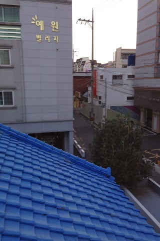
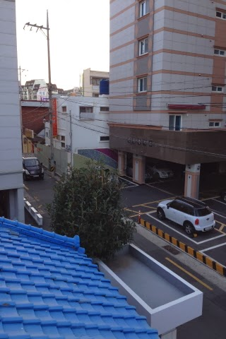
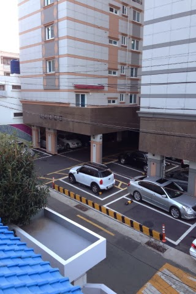
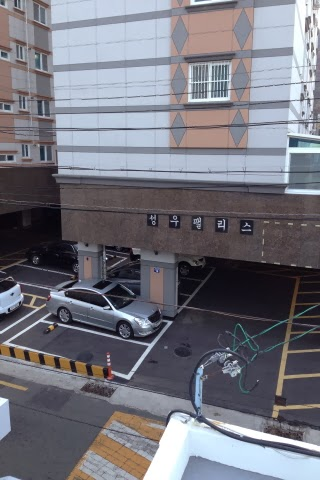
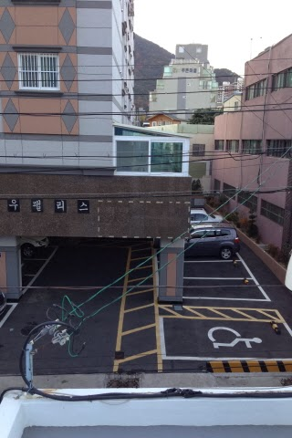
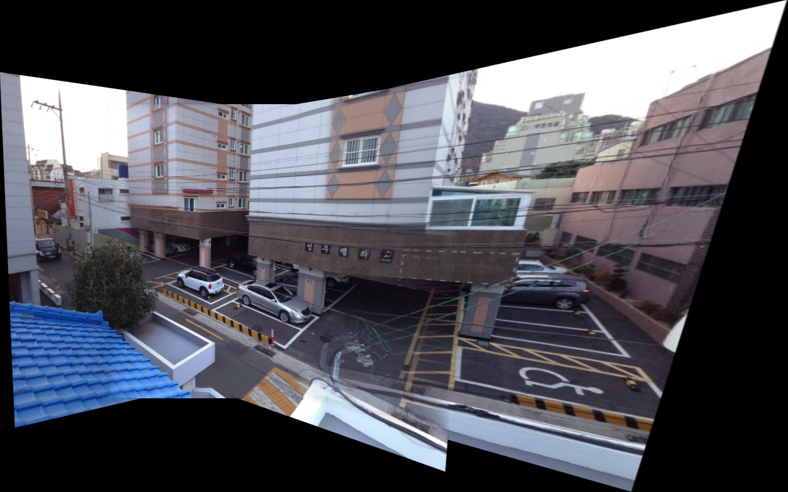

# seoultech-computervision-image-stitching

컴퓨터비전 과제 05) 주어진 이미지들 정합하여 하나의 큰 이미지를 만드는 프로그램

## 개요

여러 장의 이미지를 입력받아, 겹치는 부분을 정합하여 하나의 파노라마 이미지를 생성하는 프로그램입니다.

## 사용법

1. images/ 폴더에 합칠 이미지를 넣는다.
2. app.p를 실행하여 결과 이미지를 생성한다.

## 추가 기능

- 블렌딩: 두 이미지를 자연스럽게 연결하여 경계가 부드럽게 보이도록 처리합니다.

``` python
# 두 이미지 블렌딩
def feather_blend(self, img1_canvas: np.ndarray, result_warped: np.ndarray) -> np.ndarray:
    # 마스크 생성
    mask1 = (cv2.cvtColor(img1_canvas, cv2.COLOR_BGR2GRAY) > 0).astype(np.uint8)
    mask2 = (cv2.cvtColor(result_warped, cv2.COLOR_BGR2GRAY) > 0).astype(np.uint8)

    # distance transform (float32)
    dist1 = cv2.distanceTransform(mask1, cv2.DIST_L2, 5)
    dist2 = cv2.distanceTransform(mask2, cv2.DIST_L2, 5)

    # 가중치 계산 (겹치는 부분은 두 distance의 합으로 정규화)
    weight1 = dist1 / (dist1 + dist2 + 1e-8)
    weight2 = dist2 / (dist1 + dist2 + 1e-8)
    weight1 = np.nan_to_num(weight1)
    weight2 = np.nan_to_num(weight2)

    # 3채널로 확장
    weight1_3c = np.repeat(weight1[:, :, np.newaxis], 3, axis=2)
    weight2_3c = np.repeat(weight2[:, :, np.newaxis], 3, axis=2)

    # feather blending
    blended = (img1_canvas.astype(np.float32) * weight1_3c + result_warped.astype(np.float32) * weight2_3c).astype(
        np.uint8
    )

    return blended
```

## 결과


### 입력 이미지 예시

<div style="display: flex; gap: 10px; flex-wrap: wrap;">
    
    
    
    
    
</div>

[[입력 이미지 출처](https://study.marearts.com/2013/11/opencv-stitching-example-stitcher-class.html)]

### 결과 이미지 예시

<div>
    
</div>

